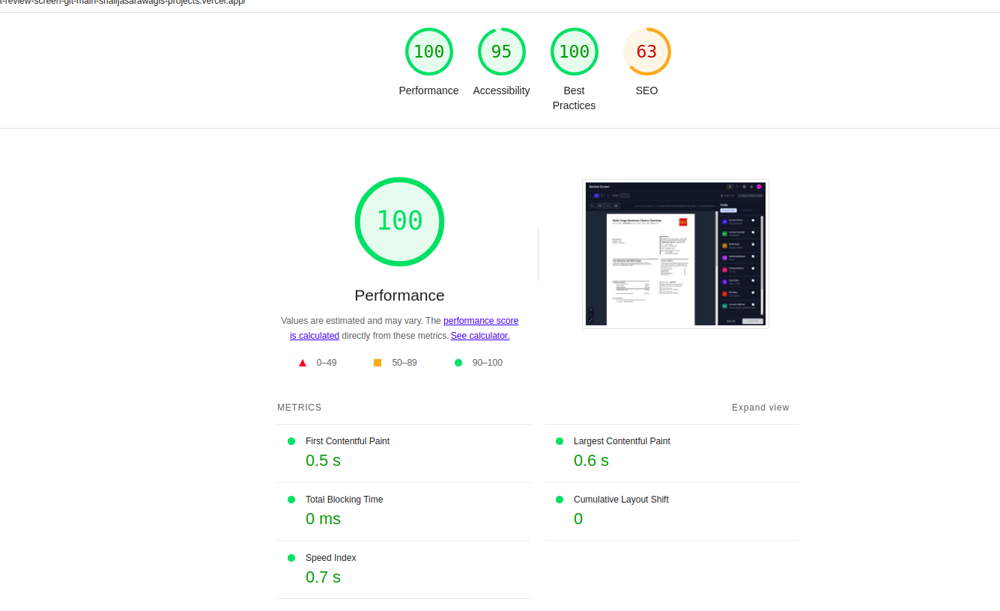

# Document Review Application

## Overview

This is a React-based web application for reviewing documents with interactive field selection, zoomable document viewing, and theme switching capabilities. The application allows users to navigate multi-page documents, select and highlight fields, and manage them via a sidebar interface with virtualized list rendering for performance.

## Features

### Core Functionality

- **Multi-Page Document Support**: Navigate through multiple pages with pagination controls
- **Document Viewer**: Interactive document display with zoom controls (75% to 200%)
- **Field Highlighting**: Dynamic highlighting of document areas based on extracted field positions
- **Right Sidebar**: Lists all extracted fields with checkboxes, badges, and field information
- **Interactive Selection**: Click or hover to highlight fields in both document and sidebar
- **Field Management**: Remove fields with dropdown menu options
- **Confirmation Workflow**: Modal-based confirmation process with success feedback

### Advanced Features

- **Dark Mode**: Sleek dark interface for reduced eye strain
- **Keyboard Shortcuts**:
  - `Ctrl/Cmd + A`: Select all fields
  - `Ctrl/Cmd + Enter`: Confirm selection
  - `Arrow Keys`: Navigate through fields
  - `+/-`: Zoom in/out
  - `F`: Toggle fullscreen
- **Responsive Design**: Optimized for desktop usage
- **TypeScript Support**: Full type safety throughout the application
- **Dynamic Field Badges**: Color-coded badges with field initials
- **Performance Optimizations**: Virtualized lists, memoization, and efficient rendering

## Project Structure

- **Components**:
  - `Home`: Main entry point, wrapping the application in a `ThemeProvider`.
  - `ReviewScreen`: Core component integrating document viewer, sidebar, header, and modals.
  - `DocumentViewer`: Renders document pages with zoom, fullscreen, and field highlighting.
  - `FieldsSidebar`: Displays a virtualized list of fields, with tabs for regular and column fields.
  - `Header`: Displays the app title and action buttons (theme toggle, notifications, etc.).
  - `Row`: Renders individual field rows in the sidebar's virtualized list.
- **Hooks**:
  - `useTheme`: Manages light/dark theme state and toggling.
  - `useDocumentData`: Loads mock document data from JSON files.
- **Dependencies**:
  - React, React Window (for virtualization), Lucide React (for icons).
  - Tailwind CSS for styling (assumed based on class names).

## Technology Stack

- **Frontend**: React 19 with TypeScript
- **Build Tool**: Vite
- **Styling**: Tailwind CSS
- **Icons**: Lucide React
- **State Management**: React Hooks (useState, useEffect, useMemo, useCallback)
- **Virtualization**: react-window for efficient list rendering
- **Performance**: CSS transforms, and optimized rendering

## Data Structure

The application works with three main data sources:

1. **pages.json**: Document page information and image URLs
2. **sections.json**: Extracted field data with positions and metadata
3. **bboxes.json**: Bounding box coordinates for field highlighting

## Installation & Setup

1. **Clone the repository**

   ```bash
   git clone <repository-url>
   cd document-review-screen
   ```

2. **Install dependencies**

   ```bash
   npm install
   ```

3. **Start development server**

   ```bash
   npm run dev
   ```

4. **Build for production**
   ```bash
   npm run build
   ```

## Usage

### Basic Workflow

1. **Document Loading**: The interface loads the document image and field data automatically
2. **Page Navigation**: Navigate through multiple pages using the pagination controls
3. **Field Review**: Review extracted fields in the right sidebar
4. **Selection**: Use checkboxes or click fields to select them for confirmation
5. **Highlighting**: Hover over fields to see corresponding areas highlighted in the document
6. **Confirmation**: Click "Confirm" to process selected fields
7. **Success**: Receive confirmation of successful processing

## Performance Insights

### Lighthouse Results Screenshot



- [Detailed Lighthouse Results](./doc/lighthouse.pdf)

### Documentation

- [Documentation File](./doc/explanation.txt): Detailed project documentation.

## Performance Optimizations

The application includes several performance optimizations:

1. **Virtualized Lists**: Only renders visible items in the field list
2. **Memoization**: Uses React.memo, useMemo, and useCallback to prevent unnecessary re-renders
3. **Efficient Rendering**: Uses CSS transforms and opacity for smooth animations
4. **Lazy Loading**: Images are loaded on-demand with proper error handling
5. **Debounced Events**: Hover and search events are debounced for better performance
6. **RequestAnimationFrame**: Used for smooth animations and interactions
7. **Optimized Field Positioning**: Percentage-based positioning for perfect alignment during rotation

## Future Enhancements

- Advanced field validation
- Export functionality
- Real-time collaboration
- Advanced search and filtering
- Fix bounding box rendering issues by validating position values against page dimensions.

## Notes

1. **Multi-Page Support**: Page 2 has been added to demonstrate multi-page scrolling functionality.
2. **Bounding Boxes Issue**: The bboxes.json file contains rectangles for page 1 with position values exceeding page height, preventing rendering of boxes.
3. **Conditional Rendering of fields**: Render Fields according to page number.
4. **Column Fields**: Children inside sections.json are rendered as column fields in the sidebar.
5. **State Management**: The application uses React state for data flow. A global store (e.g., Redux or ContextAPI) could be implemented to reduce prop drilling and support advanced document review features.
